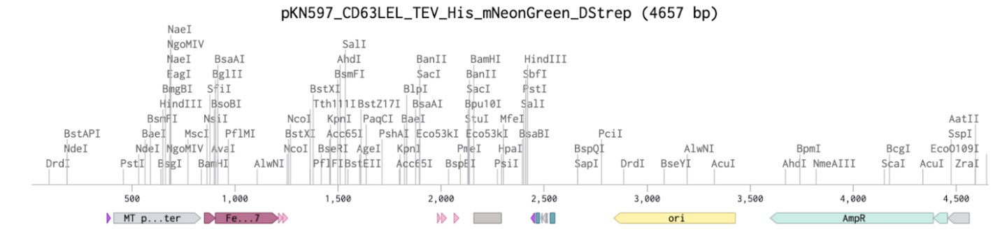
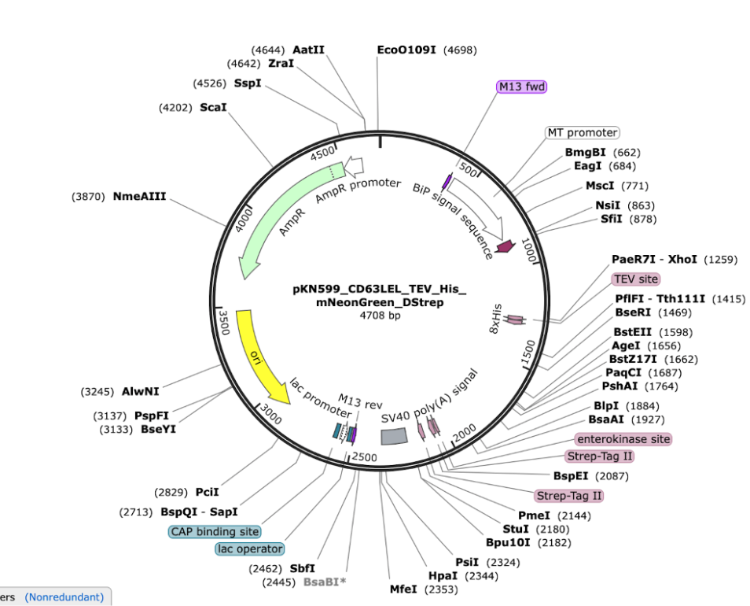
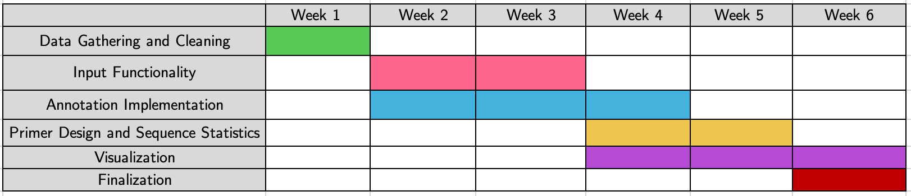

# Random_Generator_Python_Project
## Description
The project aims to provide streamlined visualization, annotation, and statistical insights for DNA and its translated amino acid sequences.
To achieve the goal the following parts will be implemented:
* Data Sources: Use REBASE and NCBI datasets.
* Input: Accept DNA sequences (text/file), auto/manual annotate, translate to AA, and import from NCBI.
* Statistics: pI, AA composition, GC content, primer annealing temp, and user/platform trends.
* Visualization: Linear/plasmid maps and primer binding sites.
* Web-based frontend (Maja Lobermeier)
  
## Functionalities
### Data Sources (Maja Lobermeier)
The data will be sourced from open datasets:
* REBASE
* NCBI (Human Reference Genome)

### Input Data 
* The system must be able to read input text data/ data from a text file containing DNA sequence of interest either as a 5’- or 3’-strand, as a plasmid, or as linear DNA (Maja Lobermeier)
* The system can automatically annotate widely-known consensus sequences/restriction sites/reporter genes/purification tags
* The system allows manual annotations of genes/sequences
* The system can translate the DNA sequence to encoded amino acid (AA) sequence
* The system can find open reading frames in the DNA
* The system provides the possibility to import data from data banks (NCBI)

### Data Storage and Handling

### Statistical analysis
* Statistics concerning the DNA/AA sequence:
  * The amino acid sequence has statistics about pI of the protein, AA composition in %, molecular weight, and enzyme restriction sites 
  * GC content in DNA
* Primer design (Sayna Boroushaki)
  * Annealing temperature
  * enzyme restriction sites in DNA
  * results downloadable as csv 

* Statistics concerning the platform:
  * Popular DNA sequences (most uploaded or referenced) 
  * Demographic data of people (customers/patients/…)
  * Statistics of user number per day/hour

### Visualization (Dinara Karakulova)
* The system can visualize the sequence as a linear 
  

  or a plasmid map.
  
  
  
  

* Download images as .png format
## Timeline

## Group Details
Group name: Random_Generator
Group code: G05
Group repository: https://github.com/Aranidin/Random_Generator_Python_Project
Tutor responsible: Jonas Rieling
Group team leader: Karakulova Dinara
Group members: Salman S. Fallah, Sayna Boroushaki, Maja Lobermeier
